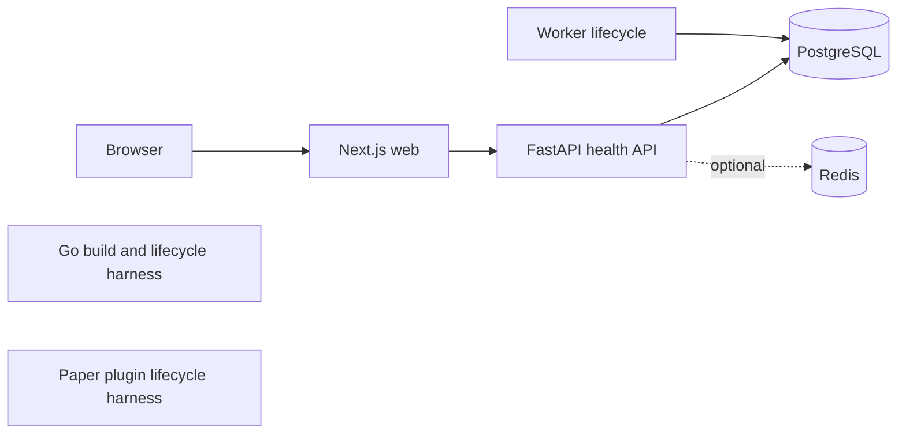

# MineOps

A foundation for secure game-server operations: a FastAPI control plane, Next.js dashboard, Go host agent and Paper plugin. MineOps remains a temporary product name.

**Phase 1 implementation is available for review. Native and Compose acceptance checks passed; the container vulnerability gate remains open; see [results](docs/phase-1-results.md).** No users, organizations, agent authentication, telemetry, server control or billing are implemented.



## Quick start

Install Docker with Compose, Git and Python 3.14. From a clean checkout:

```sh
git clone https://github.com/ridhgrg-dev/mineCraftServerMonitor.git
cd mineCraftServerMonitor
infrastructure/scripts/dev-up.sh
```

The script generates private local `.env` credentials, starts PostgreSQL/Redis, builds images, applies the explicit migration and starts services. Open [the workspace](http://localhost:3000), [API liveness](http://localhost:8000/health/live) or [development API docs](http://localhost:8000/docs). No Minecraft server is required.

## Development and checks

Native toolchain versions: Node 24.21.0, pnpm 12.4.2, Python 3.14 (production 3.14.7), uv 0.12.16, Go 1.27.1, Java 25.0.4.1+1. The Gradle wrapper pins 9.7.1.

```sh
uv sync --project apps/api --frozen
pnpm install --frozen-lockfile
infrastructure/scripts/check-python.sh
pnpm format:check
pnpm web:check
pnpm web:test
pnpm web:build
pnpm api:drift
infrastructure/scripts/check-go.sh
integrations/minecraft-paper/gradlew -p integrations/minecraft-paper spotlessCheck test build --no-daemon
pnpm exec playwright install chromium
pnpm test:e2e
```

Real integration tests require PostgreSQL/Redis; run `infrastructure/scripts/verify-compose.sh` in an isolated checkout with free local ports. It creates its own credentials and disposable Compose project, verifies migration/restore and removes only that test project's volumes.

## Documentation

- [Phase 1 results and remaining gates](docs/phase-1-results.md)
- [Development and environment variables](docs/development.md)
- [Production deployment](docs/deployment.md)
- [Backup and recovery](docs/backups.md)
- [Architecture](docs/architecture.md), [accepted ADRs](docs/adr/README.md), [security](docs/security.md)
- [Database foundation and future schema](docs/database.md)
- [Exact dependencies and compatibility decisions](docs/dependencies.md)
- [Product requirements](docs/product-requirements.md), [agent protocol proposal](docs/agent-protocol.md)

Production uses the standalone `compose.production.yaml`: Caddy is the only public service; PostgreSQL and Redis remain private. Runtime and migration database identities are separate. Redis is optional for base readiness. Phase 2 is not started.
