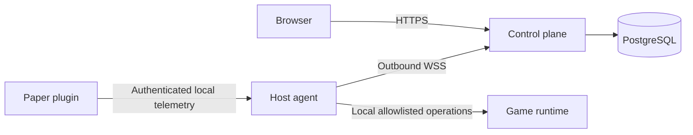

# MineOps

Architecture proposal for a Minecraft server management platform. MineOps is a temporary product name; implementation namespaces should use neutral component names.

**Status: Phase 0 design complete for review. No application has been implemented.**

Start with [review decisions](docs/review-decisions.md), then the [Phase 1 plan](docs/phase-1-plan.md). The source specification is [Initial Prompt](Prompts/Initial%20Prompt.txt).

| Artifact | Purpose |
| --- | --- |
| [Requirements](docs/product-requirements.md) | Scope, phases, measurable acceptance |
| [Architecture](docs/architecture.md) | Components, boundaries, deployment and flows |
| [Security](docs/security.md) | Threats, identity, permissions and controls |
| [Decision records](docs/adr/README.md) | Nine proposed architecture decisions |
| [Database](docs/database.md) | Logical schema and invariants |
| [Agent protocol](docs/agent-protocol.md) | Enrollment, transport and command semantics |
| [API conventions](docs/api-conventions.md) | HTTP contracts and errors |
| [Dependencies](docs/dependencies.md) | Official references and version selection |
| [Repository layout](docs/repository-layout.md) | Planned directory tree |

Development will target Intel macOS and Linux using Docker Compose; normal dashboard development will use a simulator without Minecraft. Quick start, test commands and deployment procedures will be added and verified in Phase 1. There is currently nothing to run. Phase 1 must wait for architecture review.
