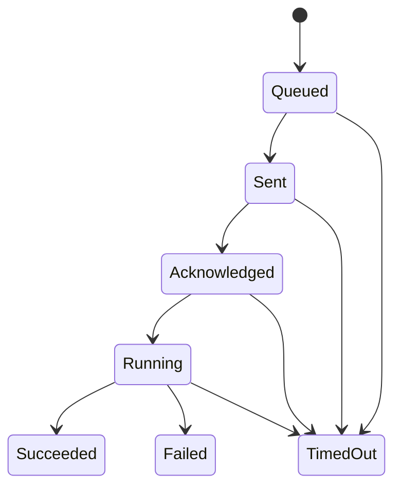

# Agent protocol proposal

Status: version 1.0 design; wire schemas and conformance tests come in implementation. All limits below are proposed defaults, configurable within safe server limits.

## Transport and enrollment

The agent initiates HTTPS enrollment/authentication and WSS `/api/v1/agents/connect` on port 443, verifying the normal TLS certificate/hostname. Never disable TLS verification in production. Use Authorization headers for credentials, not URL query strings. Browser sessions cannot authenticate this endpoint.

1. OWNER/ADMIN creates a server-scoped, 10-minute single-use enrollment token.
2. Agent reads token through hidden prompt/stdin and generates an Ed25519 key locally.
3. HTTPS enrollment challenge binds token digest, submitted public key, audience and a random server nonce with 60-second expiry. This challenge does not consume the token.
4. Agent signs the challenge bytes with its private key. The server verifies the exact stored challenge and consumes the token atomically while creating agent identity, key and initial binding. Concurrent attempts yield one success.
5. Lost enrollment response is recovered by authenticating with the registered key, not reusing the token. The token endpoint never returns another host's credentials.
6. Subsequent authentication uses a fresh one-use challenge to the registered key and yields a 5-minute opaque connect token scoped to that agent. Hash the bearer token at rest.

Use standard Ed25519 implementations, random nonces and domain-separated, length-prefixed challenge fields. Freeze byte-level fixtures before implementation; do not invent encryption or allow caller-selected signature algorithms. Challenge proof covers protocol purpose, deployment audience, key fingerprint, nonce, challenge ID and expiry. Reject consumed/expired challenges atomically. Rate-limit challenge creation.

At connection, send `hello` with supported protocol versions, agent version, boot ID, capabilities and last persisted result cursor. Server chooses a compatible version, supplies heartbeat/limits and a new connection generation. Only the newest connection generation may dispatch commands for an agent. Revalidate credential/key revocation every heartbeat and before dispatch. Renew authorization before its 5-minute expiry or reconnect with a fresh credential; do not let an old socket evade expiry.

Support current and previous minor protocol versions for at least one agent release and a proposed 90-day transition window. Additive optional fields are minor changes; changed semantics/required fields require a major version. Unknown operation types always fail closed. An incompatible agent gets a structured upgrade-required reason and cannot receive commands.

## Envelope and messages

```json
{
  "protocol_version": "1.0",
  "type": "command.request",
  "message_id": "671a365b-931f-46c1-bb74-3d46a3c7c098",
  "sent_at": "2026-09-18T16:00:00Z",
  "payload": {
    "command_id": "fd3c665a-03f1-499f-b01f-e06c9760bade",
    "server_id": "2c1c0113-f7cb-42d9-ad1d-1d5c049798a0",
    "binding_generation": 1,
    "operation": "server.restart",
    "parameters": {"grace_seconds": 30},
    "deadline_at": "2026-09-18T16:02:00Z"
  }
}
```

| Message | Direction | Purpose |
| --- | --- | --- |
| `hello`, `welcome` | Agent → API, API → agent | Version, identity-bound capabilities, connection generation |
| `heartbeat`, `heartbeat.ack` | Both | Liveness, clock estimate, runtime summary |
| `telemetry.batch`, `events.batch` | Agent → API | Typed samples or player/operational events with boot ID and sequence |
| `ingest.ack` | API → agent | Persisted contiguous cursor; never acknowledge before commit |
| `command.request` | API → agent | Allowlisted action and bounded typed parameters |
| `command.ack`, `command.started`, `command.result` | Agent → API | Journaled receipt, start, observed result |
| `command.result.ack` | API → agent | Durable result storage permits journal compaction |
| `log.chunk` | Agent → API | Approved filtered bounded stream with cursor |
| `error`, `draining` | Both | Structured safe failure or graceful disconnect |

Tenant identity comes from the authenticated agent, never message claims. Validate each server against its active binding. Per-message type schemas reject invalid/extra command parameters. Telemetry includes observation and receipt timestamps; server receipt time governs liveness. Reject nonfinite metrics, negative counts, timestamps outside replay policy and invalid units. Missing TPS/MSPT is null plus capability reason.

Default maximum frame 256 KiB, batch 100 records, log line 8 KiB and one log stream per server. Establish per-agent/org connection and byte budgets. Disable compression initially. Duplicate event IDs receive the same acknowledgement without duplicate storage. A malformed batch is rejected atomically with item indexes; agent quarantines poison records without blocking later valid data indefinitely.

## Operation allowlist

| Operation | Parameters | Validation and success criterion |
| --- | --- | --- |
| `server.status` | empty object | Local observation returned; no side effect |
| `server.start` | empty object | Bound runtime observed running/ready according to adapter |
| `server.stop` | grace_seconds 1–120 | Bound runtime observed stopped; force-kill requires local opt-in |
| `server.restart` | grace_seconds 1–120 | Old runtime stopped and new instance observed running/ready |
| `server.backup` | backup_profile_id UUID | Profile maps locally; finalized artifact and checksum exist |
| `server.logs.tail` | max_lines 1–500, duration_seconds 1–60 | Privacy-approved local source only; bounded read |

Default overall lifecycle timeout 120 seconds, backup timeout 30 minutes, logs 60 seconds. Effective timeout is the smaller of policy and command deadline. Serialize conflicting lifecycle/backup operations per server. Each adapter advertises actual capabilities; unsupported operations return `operation.not_supported`, never pretend success.

## Lifecycle, duplicate handling and ambiguity



Also allow Failed from pre-running states for validation/revocation rejection. Persist append-only events and validate monotonic transitions. The API marks Sent only after socket delivery attempt; this is not proof of agent receipt. Agent atomically journals command ID and request hash to local durable storage before acknowledging, then marks Running before invoking a side effect. The same ID with different content is rejected; the same ID with identical content returns existing state/result and never starts another execution.

A process crash between a runtime effect and result persistence makes the outcome uncertain. Exactly-once effects across that boundary are not promised. Reconcile start/stop from runtime state and restart from runtime instance/start-time evidence. If evidence cannot establish outcome, retain a structured `outcome_unknown` failure requiring operator review; never automatically re-run an ambiguous restart or backup. A new command ID represents a new explicit user intent.

Timed out means the result did not arrive in time, not that the remote action failed or rolled back. Attempt adapter cancellation safely; late results append reconciliation evidence without erasing the timeout. UI displays both timeout and later observed outcome. Do not allow a conflicting action while a previous effect may still be running without reconciliation.

Journal entries remain until server acknowledgement and until the command deadline plus replay grace (24 hours). Unresolved entries are never automatically pruned. Expired command IDs cannot execute even after journal compaction. Server-generated deadlines are checked against synchronized server time and monotonic elapsed time; excessive clock uncertainty rejects destructive operations. Maximum new-command lifetime is 30 minutes. Offline queued lifecycle actions expire quickly rather than surprising users hours later.

## Recovery and local integration

Reconnect uses full jitter with an exponential cap from 1 to 60 seconds; reset after a stable session. On shutdown stop accepting commands, flush journal/results within a bounded interval and signal draining. Bound spool by bytes/time (proposed 64 MiB); coalesce/drop oldest periodic telemetry before results/events, report dropped ranges and alert on exhaustion. Player events may replay for at most 7 days; reject older events and disclose gaps. Command results remain recoverable separately from telemetry spool limits.

Paper → agent uses loopback HTTP with a per-binding random bearer secret in a header. Containers use an explicitly configured private bridge with firewall restrictions. Plugin has no cloud credential. It snapshots supported API data on the correct scheduler and sends asynchronously with bounded queues. Event IDs include plugin boot/session identifiers for deduplication. Local credential rotation supports a short overlap and revocation. No chat or player IP payload fields exist.

Required conformance tests cover enrollment races, token/challenge replay, key rotation, revoked live sockets, version mismatch, malformed/oversize telemetry, forged bindings, clock skew, reconnect, journal corruption fail-closed behavior, crash windows, duplicate command effects, late results and sustained backpressure.
