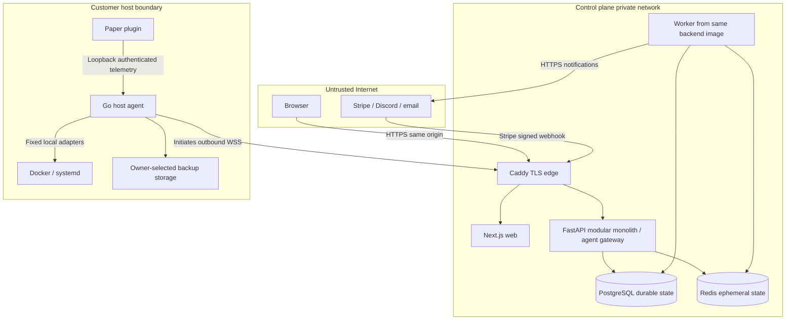
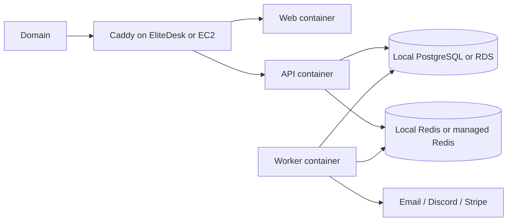

# Architecture

Status: accepted architecture; Phase 1 implementation approved. Related: [security](security.md), [schema](database.md), [protocol](agent-protocol.md), [ADRs](adr/README.md).

## Components and trust boundaries



The API owns identity, organizations/RBAC, servers, enrollment, command authorization, telemetry, players, audit, alerts, backups and billing as cohesive modules. The web app renders views; it does not duplicate authorization. Worker processes run backend domain services for aggregation, outbox delivery, alerts, billing, email and retention. PostgreSQL is authoritative for commands/jobs; Redis supplies throttles, leases and ephemeral connection routing hints.

The agent owns local configuration, durable command deduplication, runtime adapters, metrics collection and local backup artifacts. It never accepts cloud-provided executables, shell strings, filesystem paths or Docker target IDs. Server bindings map opaque platform IDs to local owner-configured targets. The Paper plugin observes supported game APIs and sends bounded local telemetry. Neither plugin absence nor unavailable game metrics disables host monitoring.

One host agent belongs to one organization and can bind multiple servers. Each server has at most one active agent binding. Host metrics belong to the agent; server metrics belong to the server, avoiding multiplied host usage. Moving bindings requires administrator authorization and a new binding generation to fence old commands.

## Command and telemetry flow

```mermaid
sequenceDiagram
  participant U as Browser
  participant A as API
  participant D as PostgreSQL
  participant G as Host agent
  participant R as Runtime
  G->>A: Outbound authenticated connection + hello
  U->>A: POST command with idempotency key
  A->>D: Authorize and commit command + audit + outbox
  A-->>U: 202 queued + command ID
  A->>G: Deliver over agent-established socket
  G->>G: Validate binding, deadline, allowlist; persist journal
  G->>A: Acknowledged / running
  G->>R: Fixed adapter action
  R-->>G: Observed outcome
  G->>A: Structured result
  A->>D: Persist transition + audit
  U->>A: Poll command
  A-->>U: Actual persisted state
```

Database outbox rows are transactionally committed with business changes. Workers claim bounded batches with leases and `FOR UPDATE SKIP LOCKED`; external deliveries are retryable with idempotency/deduplication, backoff and dead-letter visibility. Redis notifications may wake a socket owner, but periodic durable polling recovers lost notifications. Start with one API gateway instance; design connection generations and durable routing to permit more instances later. A queue product is unnecessary initially. Phase 1 includes worker lifecycle only; durable job tables and execution arrive with real features.

Agents batch host samples every 30 seconds and game health every 15 seconds; join/quit is event-driven with bounded spooling. API derives tenant identity from credentials, validates types/size/rate and inserts batches. The browser initially uses bounded polling; SSE is an optional later optimization. It never shares the agent socket.

Heartbeats and game health are separate signals. After two missed 30-second heartbeats mark agent degraded; after 120 seconds offline. Retain last-seen and stale measurements. Agent online does not prove Minecraft online. Unsupported values are null with a reason. Reconnect does not automatically repeat ambiguous operations.

## Deployment

Development Compose will provide web, API, worker, PostgreSQL and Redis with an optional simulator profile; no Minecraft requirement. Production Compose adds Caddy, built images, health checks, restart policies, persistent volumes and private networks. Only Caddy publishes ports 80/443. Run migrations as an explicit one-shot release step before application rollout, not independently in every replica. Production startup rejects demo credentials and insecure settings.

Separate public edge and data networks; Caddy cannot access the database. Mount secrets read-only, restrict writable container paths and avoid host Docker mounts in the control plane. The customer agent runs on its own host outside this Compose stack. Development-only loopback port mappings are excluded from the production effective configuration.



AWS migration changes database/cache endpoints, secrets and optional object storage configuration. Maintain the same application images and protocol. Backups go directly from customer agent to configured local or future S3-compatible storage, never through the control plane API.

## Capacity, retention and failure behavior

At 5,000 servers, 15-second game batches mean roughly 333 batches/second; host traffic depends on host count (up to roughly 167/second at 5,000 hosts). Seven days can exceed 200 million game samples. These are sizing estimates, not benchmarks. Use typed sample rows instead of one row per metric, bulk inserts, time partitions and measured disk budgets. A single EliteDesk is an initial deployment, not a promise to support the full target.

Aggregate by organization/resource/time bucket idempotently; retain sample count, sum, min and max to combine averages correctly. Store aggregation watermarks; only drop eligible raw partitions after successful aggregation and late-arrival grace. Bound disk spools and log streams; prioritize command results and player events over periodic samples. Mark data gaps explicitly.

Database outage rejects new operations and prevents success acknowledgements for uncommitted ingestion. Redis outage disables unsafe rate-limited writes with a retryable error while safe reads may continue. Worker failure leaves durable jobs recoverable. Agent disconnect changes reachability, not inferred runtime outcome. Single-host failure interrupts the service; this is not high availability.

Proposed recovery objectives: control-plane RPO 24 hours and RTO 4 hours, subject to restore rehearsal. Encrypted off-host PostgreSQL backups, secret-key recovery, volume inventory, recovery ordering and restore tests are required before launch. Minecraft world recovery has independent per-server policy and is initially owner-operated.

## Approved Phase 1 review (2026-09-18)

Redis is optional for base readiness. PostgreSQL is the sole durable authority. Phase 1 establishes database roles and transaction-local tenant context without tenant tables; RLS policies follow in Phase 2. Docker and systemd are the initial controllable runtime targets; generic/manual process control is deferred. Freeze canonical Ed25519 challenge encoding and byte fixtures before Phase 3. Architecture review is complete; implement foundation only, then stop for review.
