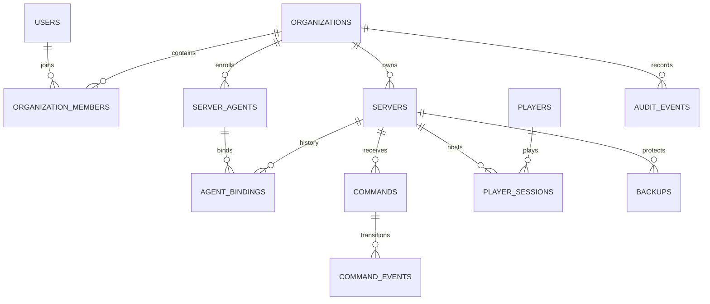

# Proposed database schema

Status: logical design for review; no DDL or migrations are implemented.

## Common conventions and isolation

Use PostgreSQL, UUID primary keys, `timestamptz` UTC timestamps, explicit foreign keys and check constraints. Mutable records have `created_at`, `updated_at` and a version counter. Tenant-owned tables require `organization_id`; their referenced resources expose unique `(organization_id, id)` keys, and all dependent references include the organization. Index foreign keys and frequent tenant filters. Avoid cascading deletion of operational history; soft-delete servers and explicitly erase organizations through a controlled workflow.

Email is normalized before uniqueness checks. Hash tokens as binary digests. Counts/durations/bytes are nonnegative, ratios have documented ranges, enum states use constrained strings. Financial values use integer minor units with currency. JSONB is reserved for schema-versioned protocol payloads, redacted audit metadata and provider-specific details, not memberships, metrics or entitlement values.

## Identity and tenancy

| Table | Principal columns | Constraints / indexes |
| --- | --- | --- |
| `users` (global) | id, normalized_email, password_hash, email_verified_at, disabled_at | unique email |
| `identity_links` (global) | id, user_id, issuer, subject | unique issuer/subject; future OIDC |
| `auth_sessions` (global) | id, user_id, family_id, access_hash, refresh_hash, access_expires_at, idle_expires_at, absolute_expires_at, rotated_at, revoked_at | unique credential hashes; user/revocation index; retain rotated hashes until family expiry |
| `identity_tokens` (global) | id, user_id, purpose, token_hash, expires_at, consumed_at | unique hash; purpose check; atomic consume |
| `organizations` | id, name, slug, deleted_at | unique active slug |
| `organization_members` | id, organization_id, user_id, role | unique org/user; valid role; lock org row when changing owners |
| `member_invitations` | id, organization_id, email, role, token_hash, invited_by, expires_at, accepted_at | one pending invitation per org/email; unique hash |

Authentication security events without a tenant live in a separate restricted `identity_audit_events` table. Tenant audit records never use a nullable organization as an isolation shortcut.

## Hosts and servers

| Table | Principal columns | Constraints / indexes |
| --- | --- | --- |
| `servers` | id, organization_id, name, game_kind, desired_state, deleted_at | org/created_at/id index |
| `server_agents` | id, organization_id, display_name, agent_version, last_seen_at, revoked_at | org/last_seen index; represents a host identity |
| `agent_keys` | id, organization_id, agent_id, public_key, fingerprint, valid_from, expires_at, revoked_at | unique fingerprint; tenant FK to agent |
| `agent_auth_challenges` | id, organization_id, agent_id, key_id, nonce_hash, expires_at, consumed_at | single use; expiry index |
| `agent_access_credentials` | id, organization_id, agent_id, key_id, token_hash, expires_at, revoked_at | unique token hash; short lifetime |
| `agent_bindings` | id, organization_id, agent_id, server_id, local_target_ref, generation, activated_at, retired_at | unique active server; unique active agent/local target; generation increments on reassignment |
| `enrollment_tokens` | id, organization_id, server_id, token_hash, created_by, expires_at, consumed_at, revoked_at | unique hash; atomic consumption; valid creator membership |
| `minecraft_servers` | server_id, organization_id, version, plugin_version, max_players, integration_last_seen_at | one-to-one tenant FK; nonnegative max_players |
| `server_worlds` | id, organization_id, server_id, world_uuid, name | unique org/server/world UUID |

Agent capabilities are schema-versioned metadata, not authority to execute cloud-supplied code. Long-lived local runtime paths and plugin secrets remain on the customer host. Durable identity and observations are stored separately; online/degraded/offline is computed from server receipt time rather than trusted device clocks.

## Players and telemetry

| Table | Principal columns | Constraints / indexes |
| --- | --- | --- |
| `players` | id, organization_id, game_kind, external_uuid, current_name, first_seen_at, last_seen_at | unique org/game/external UUID; no global cross-tenant player profile |
| `player_sessions` | id, organization_id, server_id, player_id, source_session_id, joined_at, left_at, end_reason, estimated_end | unique org/server/source session; end >= start; one active session per server/player |
| `ingested_events` | id, organization_id, agent_id, boot_id, sequence, event_type, observed_at, received_at | unique agent/boot/sequence; dedup retention exceeds replay window |
| `host_samples` | organization_id, agent_id, sampled_at, received_at, boot_id, sequence, cpu_ratio, memory_used_bytes, memory_total_bytes, disk_used_bytes, disk_total_bytes, uptime_seconds | partition by received_at; tenant/agent/time index; bounds checks |
| `game_samples` | organization_id, server_id, sampled_at, received_at, boot_id, sequence, player_count, tps, mspt, runtime_state | partition by received_at; tenant/server/time index; nullable unavailable values |
| `metric_aggregates` | organization_id, resource_kind, resource_id, metric_key, bucket_start, resolution_seconds, count, sum, min, max | unique tenant/resource/metric/bucket/resolution; separate typed resource FKs in physical schema |
| `aggregation_watermarks` | organization_id, resource_kind, shard_key, resolution_seconds, complete_through | unique aggregation stream |
| `operational_events` | id, organization_id, server_id, agent_id, event_type, severity, safe_message, observed_at, received_at | org/server/received_at/id; bounded redacted payload |

Physical migrations will split polymorphic aggregate resource references into host and server aggregate tables to retain real foreign keys. Time-partitioned uniqueness must include the partition key; use the separate ingestion ledger for cross-partition replay deduplication. All samples are typed rows, not one row per scalar metric. CPU ratio means used fraction of total host capacity (0–1), bytes are integers, TPS/MSPT are finite nonnegative numbers.

Reconnect reconciles player snapshots with open sessions. Missing quits are explicitly estimated and excluded or labeled in precise playtime analysis. Player session totals are derived/aggregated; sample player count does not fabricate named player sessions. Retention metrics require cohort maturity and coverage checks.

## Commands, backups and alerts

| Table | Principal columns | Constraints / indexes |
| --- | --- | --- |
| `commands` | id, organization_id, server_id, agent_id, binding_generation, requested_by, operation, schema_version, parameters, state, idempotency_key, request_hash, requested_at, deadline_at | unique org/actor/scope/key; org/server/time and state/deadline indexes |
| `command_executions` | id, organization_id, command_id, delivery_attempt, connection_generation, acknowledged_at, started_at, completed_at, outcome, error_code | unique command/delivery attempt; an attempt records delivery, not permission to re-execute |
| `command_events` | id, organization_id, command_id, source_event_id, state, occurred_at, received_at, safe_detail | unique command/source event; append-only transitions |
| `backup_policies` | id, organization_id, server_id, local_profile_ref, schedule, timezone, retention_count, retention_days, consistency_mode | positive retention; profile is an opaque local config reference |
| `backups` | id, organization_id, server_id, command_id, policy_id, state, started_at, completed_at, size_bytes, checksum, storage_kind, artifact_ref, failure_code | unique command; index org/server/start; preserve failed/expired metadata |
| `alert_rules` | id, organization_id, server_id, metric_key, comparator, threshold, duration_seconds, cooldown_seconds, enabled | threshold/unit compatibility validated; positive durations |
| `alerts` | id, organization_id, rule_id, server_id, state, triggered_at, resolved_at, last_notified_at | at most one active alert per rule/server |
| `notification_channels` | id, organization_id, kind, encrypted_secret, key_id, enabled | ciphertext only; tenant-bound AEAD context |
| `alert_rule_channels` | organization_id, rule_id, channel_id | composite primary key and tenant FKs |
| `notification_deliveries` | id, organization_id, alert_id, channel_id, transition_id, attempt_count, state, next_attempt_at | unique alert/channel/transition |

Terminal command observations are retained even after timeout; reconciliation appends evidence rather than silently rewriting history. Local agent journal is independent of these tables and survives process crashes. No database transaction can atomically commit a remote runtime side effect; see protocol limitations.

## Billing and background work

| Table | Principal columns | Constraints / indexes |
| --- | --- | --- |
| `billing_customers` | id, organization_id, provider_customer_id | unique org/provider customer |
| `subscriptions` | id, organization_id, provider_subscription_id, status, period_end, last_reconciled_at | unique provider subscription; no card data |
| `entitlement_definitions` (global) | key, value_type | unique key |
| `plan_entitlements` (global) | plan_key, entitlement_key, boolean_value, integer_value | unique plan/key; exactly one matching typed value |
| `organization_entitlements` | organization_id, entitlement_key, boolean_value, integer_value, source, valid_until | unique org/key; typed-value check |
| `billing_webhook_events` (restricted ingress) | provider_event_id, organization_id, type, received_at, processed_at, payload_hash, state | unique provider ID; org nullable only until verified customer mapping; no tenant API reads |
| `outbox_jobs` | id, organization_id, kind, payload_version, payload, available_at, attempts, lease_until, completed_at | pending available_at index; tenant-bound jobs; dead-letter state |
| `audit_events` | id, organization_id, actor_kind, actor_id, action, resource_kind, resource_id, request_id, command_id, occurred_at, metadata | org/time/id index; INSERT/SELECT only for runtime role |

Stripe events are durable and idempotent. Out-of-order events trigger reconciliation against provider subscription state rather than blindly overwriting with arrival order. Server/member quota checks lock the organization or quota row so concurrent requests cannot exceed limits. Initial free entitlements are explicit configuration before Stripe delivery.

## Migration and retention strategy

Phase 1 creates migration infrastructure and role separation; Phase 2 first creates identity/tenant tables with RLS tests. Later tables arrive with their owning feature. Prefer additive migrations, backfill with bounded jobs and remove old columns only after compatibility windows. Test upgrade from previous schema and clean bootstrap against PostgreSQL, not SQLite.

Proposed retention: raw samples 7 days; 5-minute 30 days; hourly 365 days; ingestion dedup 8 days for maximum 7-day event replay; operational events 30 days; audit 365 days by published policy. Session analytics and billing retention require explicit product/legal policy before launch. Tenant erasure removes primary data, revokes credentials and records backup expiry; do not silently retain personal identifiers indefinitely. Retention settings must remain within measured storage budgets and plan entitlements.

